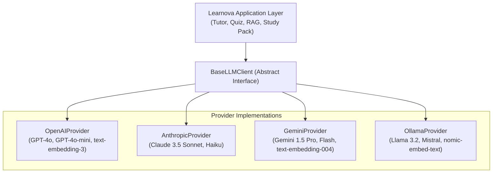
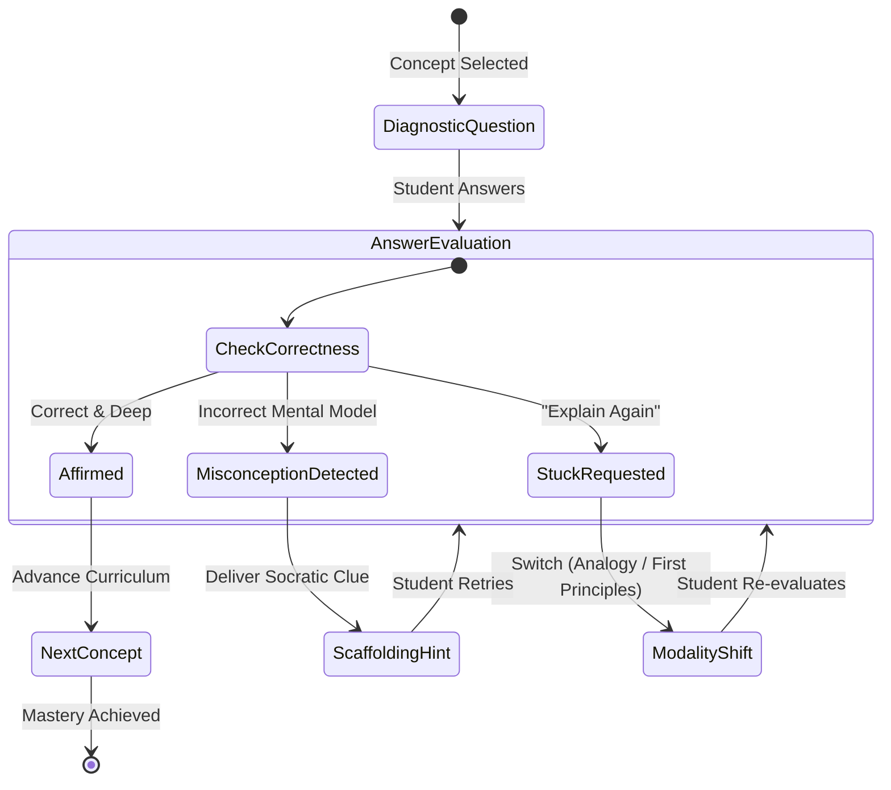

# LEARNOVA — AI & Pedagogical Intelligence Specification

> **"Teach not by giving the answer, but by asking the question that illuminates the path."**

---

## 1. Provider Abstraction Architecture

Learnova is engineered to be entirely model-agnostic. All artificial intelligence interactions pass through an abstract provider interface (`BaseLLMClient`). Switching between cloud providers (OpenAI, Anthropic, Google Gemini) and local offline inference (Ollama, vLLM) requires zero changes to core business logic.



### 1.1 Interface Definition (`BaseLLMClient`)
```python
from abc import ABC, abstractmethod
from typing import AsyncGenerator, Type, TypeVar, Optional, List, Dict, Any
from pydantic import BaseModel

T = TypeVar("T", bound=BaseModel)

class LLMResponse(BaseModel):
    content: str
    tokens_prompt: int
    tokens_completion: int
    finish_reason: str

class BaseLLMClient(ABC):
    @abstractmethod
    async def generate_text(
        self,
        messages: List[Dict[str, str]],
        temperature: float = 0.2,
        max_tokens: Optional[int] = None
    ) -> LLMResponse:
        """Generates plain text response."""
        pass

    @abstractmethod
    async def generate_structured(
        self,
        messages: List[Dict[str, str]],
        response_model: Type[T],
        temperature: float = 0.1
    ) -> T:
        """Enforces strict JSON schema validation matching a Pydantic model."""
        pass

    @abstractmethod
    async def generate_stream(
        self,
        messages: List[Dict[str, str]],
        temperature: float = 0.2
    ) -> AsyncGenerator[str, None]:
        """Streams text chunks in real-time."""
        pass

    @abstractmethod
    async def embed_text(
        self,
        texts: List[str]
    ) -> List[List[float]]:
        """Computes dense vector embeddings for input texts."""
        pass
```

### 1.2 Configuration & Provider Switch
The active provider is determined via environment variables in `.env`:
```env
AI_PROVIDER=openai               # Options: openai, anthropic, gemini, ollama
AI_MODEL=gpt-4o-mini             # Primary chat/tutor model
AI_EMBEDDING_PROVIDER=openai     # Options: openai, gemini, local
AI_EMBEDDING_MODEL=text-embedding-3-small
OLLAMA_BASE_URL=http://localhost:11434
```

---

## 2. Prompt Engineering Specifications

All prompts adhere to strict behavioral rules:
1. **Source Grounding First:** Cite exact chunks or refuse to invent facts.
2. **Pedagogical Patience:** Never solve problems for students; illuminate principles.
3. **Structured Outputs:** Return well-formed JSON when machine parsing is required.

### 2.1 Socratic Pedagogical Tutor System Prompt
```markdown
You are LEARNOVA, an expert academic tutor embodying the Socratic method and cognitive apprenticeship.
Your student is studying source material provided in the context below.

CORE OBJECTIVES:
1. DO NOT give direct answers to homework or conceptual questions immediately.
2. Guide the student step-by-step using scaffolding: begin with first principles, ask guiding questions, and let the student bridge the gap.
3. Keep explanations crisp, accurate, and physically intuitive. Avoid verbosity.
4. When citing source facts, use strict citation envelopes: [[Doc:<doc_id>, Page:<p>, Chunk:<k>]].
5. If the student makes an error, diagnose the misconception with patience and provide a minimal hint.

CURRENT TOPIC CONTEXT:
{topic_context}

RETRIEVED SOURCE EXCERPTS:
{retrieved_chunks}
```

### 2.2 First-Principles Explainer System Prompt
```markdown
You are a First-Principles Explainer for LEARNOVA.
Your goal is to deconstruct complex, intimidating concepts into their fundamental, indisputable axiomatic truths.

METHODOLOGY:
1. Strip away all unnecessary jargon and abstract notation.
2. Identify the single root mechanism or law of nature driving the phenomenon.
3. Build the concept back up step-by-step:
   - Step 1: The Core Axiom (What is fundamentally true?).
   - Step 2: The Driving Interaction (What causes what?).
   - Step 3: The Observed Result (Why does this lead to the formula/phenomenon?).
4. Conclude with an intuitive check question.
```

### 2.3 Misconception Diagnostic Detective System Prompt
```markdown
You are the Misconception Diagnostic Engine for LEARNOVA.
Analyze the student's submitted response to the given diagnostic question.

TAXONOMY OF MISCONCEPTIONS:
- CONCEPTUAL: Student fundamentally misunderstands the physical or logical principle (e.g., confusing acceleration with velocity).
- PROCEDURAL: Student knows the concept but executed mathematical steps or logic incorrectly.
- FACTUAL: Student misremembered a specific definition, constant, or historical fact.
- TERMINOLOGICAL: Student confused terminology or vocabulary without conceptual flaw.

OUTPUT SCHEMA (JSON):
{
  "is_correct": boolean,
  "confidence_score": float (0.0 to 1.0),
  "misconception_type": "NONE" | "CONCEPTUAL" | "PROCEDURAL" | "FACTUAL" | "TERMINOLOGICAL",
  "root_cause_summary": string,
  "pedagogical_prescription": string,
  "guided_hint": string
}
```

### 2.4 Adaptive Quiz Generator Prompt
```markdown
Generate {question_count} high-discrimination questions based on the provided document topics.

REQUIREMENTS:
1. Include a mix of Multiple Choice Questions (MCQ) and Short Answer conceptual questions.
2. For MCQs:
   - Provide 4 options (A, B, C, D).
   - Only ONE option must be completely correct.
   - The 3 distractors must NOT be arbitrary; each distractor MUST represent a common, documented student misconception.
   - Provide a detailed explanation citing the source chunk for why each distractor is wrong and why the correct answer is right.
3. Output MUST adhere strictly to the JSON schema.
```

---

## 3. RAG Retrieval & Strict Citation Architecture

```
 ┌──────────────────────┐
 │ Raw Document (PDF)   │
 └──────────┬───────────┘
            │
            ▼
 ┌─────────────────────────────────────────────────────────┐
 │ PyMuPDF Layout-Aware Extraction                         │
 └──────────┬──────────────────────────────────────────────┘
            │
            ▼
 ┌─────────────────────────────────────────────────────────┐
 │ Recursive Semantic Splitter                             │
 │ Window: 500-800 tokens | Overlap: 100 tokens            │
 │ Preserves headings, equations, and page boundaries      │
 └──────────┬──────────────────────────────────────────────┘
            │
      ┌─────┴────────────────────────┐
      ▼                              ▼
 ┌───────────────────────┐      ┌─────────────────────────┐
 │ Dense Embeddings      │      │ Sparse Inverted Index   │
 │ text-embedding-3-sm   │      │ BM25 Algorithm          │
 └──────────┬────────────┘      └────────────┬────────────┘
            │                                │
            └───────────────┬────────────────┘
                            ▼
 ┌─────────────────────────────────────────────────────────┐
 │ Reciprocal Rank Fusion (RRF) Re-Ranking                 │
 │ Top-K Candidate Selection (K=4)                         │
 └──────────┬──────────────────────────────────────────────┘
            │
            ▼
 ┌─────────────────────────────────────────────────────────┐
 │ Grounding & Citation Verification Filter                │
 │ Validates citations: [[Doc:id, Page:p, Chunk:k]]        │
 └─────────────────────────────────────────────────────────┘
```

### 3.1 Recursive Semantic Chunking Strategy
- **Token Target:** 600 tokens (min 400, max 800).
- **Overlap:** 100 tokens with sliding boundary.
- **Separators Hierarchy:**
  1. `\n\n# ` (Markdown Heading 1)
  2. `\n\n## ` (Markdown Heading 2)
  3. `\n\n` (Paragraph break)
  4. `(?<=\. )\n` (Sentence termination)
  5. ` ` (Word boundary)
- **Metadata Inheritance:** Every generated chunk inherits `document_id`, `page_number`, `chunk_index`, and `section_title`.

### 3.2 Hybrid Search with Reciprocal Rank Fusion (RRF)
To balance semantic conceptual matching with exact technical term matches (e.g., $E = mc^2$, specific acronyms), Learnova combines dense cosine similarity search with sparse BM25 scoring:

$$RRF\_Score(d \in D) = \sum_{m \in \{dense, bm25\}} \frac{1}{k + r_m(d)}$$

Where:
- $k = 60$ (smoothing constant)
- $r_m(d)$ is the rank position of document chunk $d$ in the result set of model $m$.

### 3.3 Citation Syntax & Verification Engine
Every citation token is formatted as:
`[[Doc:<doc_id>, Page:<page_number>, Chunk:<chunk_id>]]`

**Hallucination Verification Protocol:**
1. LLM output is scanned with the regular expression:
   `r"\[\[Doc:(?P<doc_id>[^,]+),\s*Page:(?P<page>\d+),\s*Chunk:(?P<chunk>[^\]]+)\]\]"`
2. The verification engine checks:
   - Does `<chunk_id>` exist in the Top-K retrieved candidate pool?
   - Does the source chunk text substantiate the surrounding sentence?
3. If an ungrounded or non-existent chunk ID is produced, the engine flags the response and executes a corrective prompt repair loop.

---

## 4. Multi-Strategy Pedagogical Algorithms

### 4.1 Socratic Scaffolding State Machine
The tutoring engine tracks dialogue progress through a four-stage state machine:



### 4.2 Bayesian Knowledge Tracing (BKT)
To model the latent probability $P(L_t)$ that a student has truly mastered a specific topic at interaction step $t$:

#### Model Parameters
- $P(L_0)$: Prior probability of knowing the topic (default: $0.10$).
- $P(T)$: Probability of learning the concept on a step (transition rate, default: $0.15$).
- $P(G)$: Probability of a lucky guess (guess rate, default: $0.20$).
- $P(S)$: Probability of an accidental slip (slip rate, default: $0.05$).

#### Posterior Calculation Upon Observation:
If the student answer is **correct** ($obs = 1$):
$$P(L_t | obs=1) = \frac{P(L_{t-1}) \cdot (1 - P(S))}{P(L_{t-1}) \cdot (1 - P(S)) + (1 - P(L_{t-1})) \cdot P(G)}$$

If the student answer is **incorrect** ($obs = 0$):
$$P(L_t | obs=0) = \frac{P(L_{t-1}) \cdot P(S)}{P(L_{t-1}) \cdot P(S) + (1 - P(L_{t-1})) \cdot (1 - P(G))}$$

#### Next Step Prediction:
$$P(L_{t+1}) = P(L_t | obs) + (1 - P(L_t | obs)) \cdot P(T)$$

When $P(L_t) \ge 0.85$, the topic state is classified as **`MASTERED`**.

### 4.3 Spaced Repetition Memory Retention (SuperMemo SM-2 Adaptation)
Learnova calculates memory decay and schedules the next active retrieval session:

#### Inputs:
- $q$: Performance grade on evaluation ($0$ to $5$).
  - $5$: Perfect response with rapid recall.
  - $4$: Correct response after slight hesitation.
  - $3$: Correct response with significant effort.
  - $2$: Incorrect response; correct answer seemed easy upon reveal.
  - $1$: Incorrect response; correct answer was unfamiliar.
  - $0$: Complete blackout.
- $n$: Repetition count (number of consecutive successful reviews where $q \ge 3$).
- $EF$: Easiness Factor (initial value: $2.5$).

#### Easiness Factor Update Formula:
$$EF' = \max\left(1.3, \; EF + \left(0.1 - (5 - q) \cdot (0.08 + (5 - q) \cdot 0.02)\right)\right)$$

#### Interval Calculation:
$$I(n) = \begin{cases} 
1 \text{ day} & \text{if } n = 1 \\ 
6 \text{ days} & \text{if } n = 2 \\ 
I(n-1) \cdot EF' & \text{if } n > 2 
\end{cases}$$

If $q < 3$, the repetition counter resets to $n = 0$ and the interval resets to $I = 1$ day.
