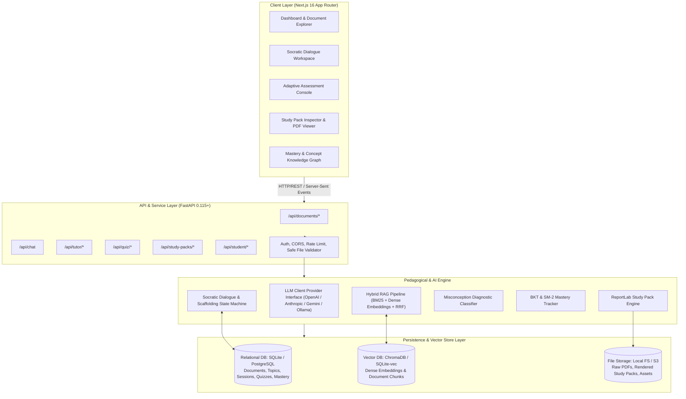
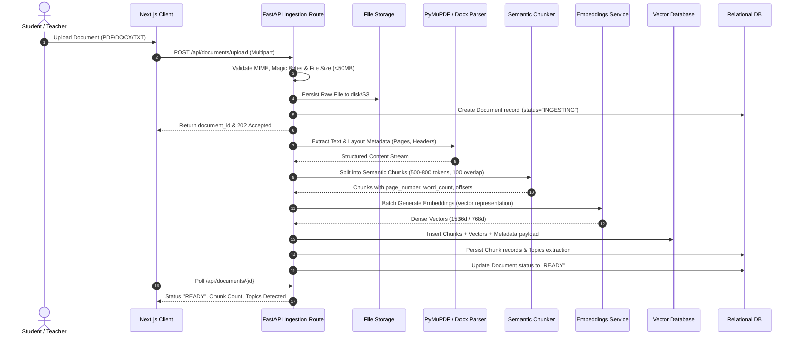
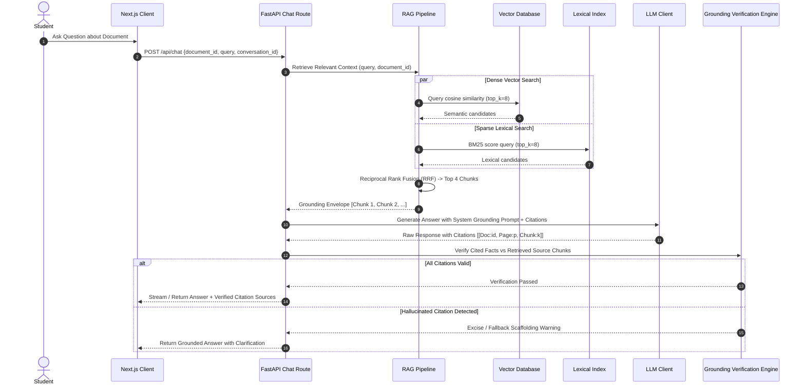
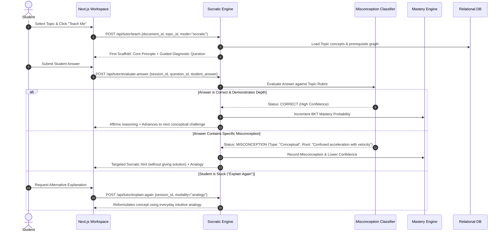
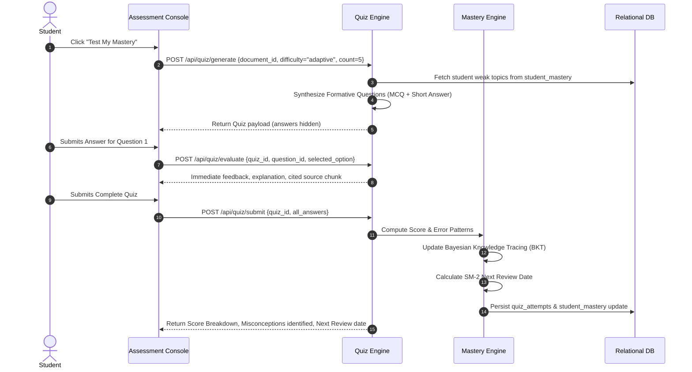
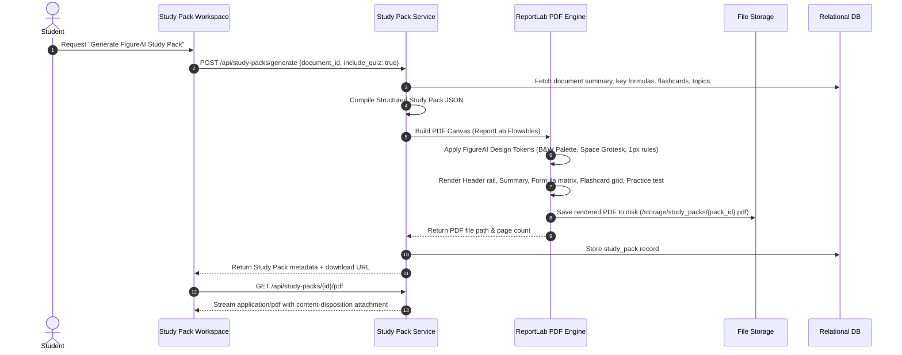
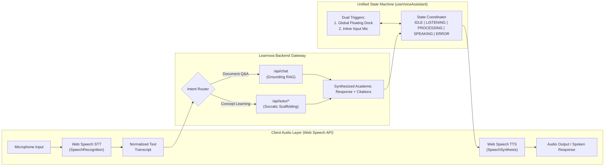

# LEARNOVA — System Architecture Blueprint

> **"Don't just help the student read... understand, practice, remember, master."**

---

## 1. System Overview & Core Philosophy

**LEARNOVA** is a production-grade, citation-grounded AI Personal Teaching Assistant engineered to transform passive reading into active, durable learning. Traditional AI study tools act as passive summarizers or answers-on-demand bots, which inadvertently encourage superficial comprehension and passive recognition rather than deep cognitive mastery.

Learnova enforces a four-pillar pedagogical lifecycle:
```
           ┌────────────────────────────────────────────────────────┐
           │                     LEARNOVA CYCLE                     │
           │                                                        │
           │    1. UNDERSTAND  ──►  2. PRACTICE                     │
           │          ▲                    │                        │
           │          │                    ▼                        │
           │       4. MASTER   ◄──  3. REMEMBER                     │
           └────────────────────────────────────────────────────────┘
```

1. **Understand (Scaffolded Comprehension):** The student interacts with a Socratic Tutor that deconstructs complex source material into first principles, using analogical reasoning and interactive inquiry without giving away answers prematurely.
2. **Practice (Active Retrieval & Misconception Diagnosis):** Dynamic quizzes, open-ended formative checks, and targeted flashcards assess the student's mental model. Errors are analyzed to isolate specific misconceptions (conceptual, procedural, factual, or terminological).
3. **Remember (Spaced Repetition & Cognitive Reinforcement):** Knowledge retention algorithms (adapted from SuperMemo SM-2 and Bayesian Knowledge Tracing) calculate decay intervals and schedule targeted re-testing before forgetting occurs.
4. **Master (Synthesized Artifacts & Proof-of-Competence):** Students generate high-fidelity, printable Study Packs formatted according to the **FigureAI** design philosophy via a dedicated ReportLab PDF engine, while their mastery profile updates deterministically.

---

## 2. High-Level System Architecture

Learnova is structured as a decoupled, modular service-oriented system: a high-performance **FastAPI (Python 3.11+)** backend delivering asynchronous REST endpoints and background computation tasks, paired with a modern **Next.js 16 (React 19, TypeScript)** frontend utilizing the **FigureAI** monochrome design system.



---

## 3. Core System Components

### 3.1 FastAPI Backend Engine
- **Runtime:** Python 3.11+ running with `uvicorn` / `gunicorn` ASGI workers.
- **Contract Enforcement:** Strict Pydantic v2 data models for input validation, output serialization, and schema generation.
- **Dependency Injection:** Modular service architecture decoupling database sessions, AI model providers, vector indexing, and file systems.
- **Background Processing:** Asynchronous document ingestion, chunking, embedding generation, and ReportLab PDF compiling handled via `asyncio` background tasks with progress polling.

### 3.2 Next.js 16 Frontend
- **Framework:** Next.js 16 with React 19 and TypeScript, utilizing the App Router architecture.
- **Styling Architecture:** Tailwind CSS v4 configured with the FigureAI aesthetic tokens. Zero clutter, monochromatic palette, high contrast, geometric precision.
- **Interactive Workspaces:**
  - *Split-Pane Document Workspace:* Source document viewer on the left, Socratic AI dialogue rail on the right with interactive citation deep-links.
  - *Formative Assessment Arena:* Instantaneous feedback, misconception highlights, and hint reveal mechanisms.
  - *Knowledge Graph Visualizer:* Topic dependency tree showcasing mastery levels from Novice to Master.

### 3.3 Storage & Vector Database
- **Relational Storage:** SQLite (zero-config local default) and PostgreSQL (production deployment) managed via SQLAlchemy 2.0 / Alembic migrations. Handles users, documents, topics, dialogue sessions, quizzes, and mastery states.
- **Vector Storage:** ChromaDB / SQLite-vec persistent store. Stores chunk embeddings with metadata: `document_id`, `page_number`, `chunk_index`, `token_count`, and `bounding_box` offsets where available.
- **File System:** Safe, partitioned storage for raw incoming uploads (`/storage/uploads/{doc_id}`) and compiled study pack PDFs (`/storage/study_packs/{pack_id}`).

### 3.4 Hybrid RAG Pipeline
- **Parsing:** PyMuPDF (`fitz`), `pdfplumber`, and `python-docx` extract text with layout awareness, font sizes (headers vs body), and page-level bounding.
- **Recursive Semantic Chunking:** Target chunk size of 500–800 tokens with 100-token sliding overlap. Boundary detection respects Markdown headers, sentence terminators, and paragraph breaks.
- **Dual Retrieval & Re-ranking:**
  - Dense semantic retrieval via embedding models (e.g., `text-embedding-3-small`, `all-MiniLM-L6-v2`).
  - Sparse lexical search via BM25 for precise keyword matching (equations, acronyms, specific definitions).
  - Reciprocal Rank Fusion (RRF) combines scores into a unified top-K candidate list.
- **Strict Grounding:** Every retrieved chunk carries an immutable citation envelope `[[Doc:id, Page:p, Chunk:k]]`. If the LLM produces statements not backed by retrieved chunks, grounding filters flag or excise the content.

### 3.5 Pedagogical Tutor Engine
- **Stateful Socratic Loop:** The tutor maintains pedagogical state (`curriculum_node`, `current_question`, `scaffolding_tier`, `consecutive_errors`).
- **Four Scaffolding Modalities:**
  1. *Socratic Inquiry:* Asks guided questions to stimulate critical analysis.
  2. *First-Principles Deconstruction:* Breaks down concepts into fundamental truths.
  3. *Analogy & Concrete Mapping:* Translates abstract formulations into intuitive real-world mechanisms.
  4. *Feynman Explanation Test:* Prompts the student to teach the concept simply to verify genuine understanding.
- **Misconception Detection:** When a student gives an erroneous response, the engine evaluates whether the error stems from a conceptual misunderstanding, procedural slip, factual omission, or vocabulary confusion.

### 3.6 ReportLab PDF Engine
- **Publication-Grade Engine:** Generates downloadable, print-ready Study Packs with FigureAI visual rules.
- **Structured Sections:**
  1. Header with metadata rail, document hash, generated timestamp, topic breakdown.
  2. Executive Conceptual Summary.
  3. Key Equations & Axioms Reference Table.
  4. Misconceptions & Pitfall Warnings table.
  5. Flashcard Cut-Out / Study Cards.
  6. Formative Self-Assessment Exam with Answer Key & Explanations.
- **Styling Rules:** 1px hairline rules, monospace data labels, bold geometric headings, generous whitespace, dual-column body layout.

---

## 4. FigureAI Design System Mapping

The user interface and generated PDF documents strictly adhere to the **FigureAI** industrial minimalist aesthetic:

### 4.1 Color System
| Token Name | Hex Code | Tailwind / CSS Variable | Purpose |
| :--- | :--- | :--- | :--- |
| **Lab White** | `#ffffff` | `bg-white`, `text-white` | Primary canvas, cards, high-contrast highlights |
| **Figure Black** | `#0c0c0c` | `bg-[#0c0c0c]`, `text-[#0c0c0c]` | Deep primary dark surface, main dark canvas |
| **Absolute Black** | `#000000` | `bg-[#000000]`, `text-[#000000]` | Extreme contrast elements, high-priority buttons |
| **Machine Gray** | `#6d6d6d` | `text-[#6d6d6d]`, `border-[#6d6d6d]` | Secondary labels, timestamps, metadata, captions |
| **Calibration Gray** | `#cecece` | `border-[#cecece]`, `bg-[#cecece]/10` | 1px hairline borders, structural rails, subtle divider lines |

#### Functional Accents (Subtle & Monochromatic Dominance)
- **Status Mastered / Valid:** `#10b981` (Signal Green, 10% opacity fills with crisp 1px borders)
- **Status Reviewing / Warning:** `#f59e0b` (Amber, reserved for misconception alerts)
- **Status Deficient / Critical:** `#ef4444` (Precision Crimson, reserved for incorrect answers)

### 4.2 Typography Hierarchy
- **Display & Technical Headers:** `Space Grotesk` (Geometric sans-serif, uppercase tracking `tracking-wider`, weights 500, 600, 700).
  - Used for: Brand title, section titles, KPI figures, status badges, technical specification rails.
- **Body & Reading Text:** `Inter` (Neutral humanist sans-serif, weights 400, 500, clean line-height `leading-relaxed`).
  - Used for: Socratic dialogues, explanations, document texts, quiz prompts.
- **Code & Metadata:** `JetBrains Mono` or `Geist Mono` (`font-mono`, weights 400, 500).
  - Used for: Citation tags `[Doc #1, p. 12]`, chunk hashes, equation references, JSON payloads.

### 4.3 Visual Components & Layout Patterns
1. **Pill Buttons:**
   - Primary: `rounded-full bg-[#0c0c0c] text-white px-5 py-2 text-xs font-mono uppercase tracking-wider hover:bg-[#000000] border border-[#0c0c0c]`
   - Secondary / Ghost: `rounded-full bg-white text-[#0c0c0c] px-5 py-2 text-xs font-mono uppercase tracking-wider hover:bg-[#f5f5f5] border border-[#cecece]`
2. **Technical Specification Rails:**
   - Thin vertical or horizontal bars showing document metadata (e.g., `DOC-ID // 98B4F · PAGES // 42 · EMBEDDINGS // 312 CHUNKS · STATUS // INDEXED`).
3. **1px Hairline Rules:**
   - Crisp borders: `border border-[#cecece]` or `divide-y divide-[#cecece]` with sharp or minimal rounding (`rounded-lg`).
4. **Zero Fluff Philosophy:**
   - No gratuitous gradients, drop-shadows are strictly flat or micro (`shadow-sm`), no noisy decorative iconography.

---

## 5. Architectural Data Flow Diagrams

### 5.1 Document Ingestion & Chunking Flow


### 5.2 Citation-Grounded RAG Retrieval Flow


### 5.3 Pedagogical Socratic Dialogue Loop


### 5.4 Quiz Assessment & Spaced Repetition Mastery Flow


### 5.5 ReportLab Study Pack PDF Generation Flow


---

## 6. Security, Safety & Grounding Principles

### 6.1 Grounding & Anti-Hallucination Guardrails
1. **Explicit Knowledge Boundary:**
   - Prompt instructions strictly enforce: *"You are an academic tutor constrained to the provided source document. If a topic is absent or ambiguous in the source, state clearly that it is not covered, rather than inventing facts."*
2. **Citation Envelope Structure:**
   - Every factual claim made by the RAG model must be accompanied by an inline citation token: `[[Doc:{id}, Page:{p}, Chunk:{k}]]`.
   - The backend validates all emitted citation tokens against the active document chunk cache. Any citation referencing a non-existent or un-retrieved chunk triggers an immediate hallucination rewrite.
3. **General Pedagogical Scaffolding vs. Source Content:**
   - Pure pedagogical reasoning (e.g., asking Socratic questions, proposing analogies, providing math mnemonics) is clearly tagged as `scaffolding`, while factual definitions and formulas are tagged as `grounded_source`.

### 6.2 File Handling & Ingestion Security
- **MIME & Magic Bytes Inspection:** Verification using `python-magic` prevents file extension spoofing. Allowed types: `application/pdf`, `application/vnd.openxmlformats-officedocument.wordprocessingml.document`, `text/plain`, `text/markdown`.
- **Payload Limits:** Maximum single file upload limit enforced at 50MB. Maximum total page count enforced at 300 pages per document to prevent memory exhaustion (DoS).
- **Sanitization:** All uploaded filenames are normalized using UUIDv4 slugs on disk. Path traversal (`../../`) is prevented by path resolution checks.
- **Content Stripping:** Macro execution, embedded Javascript, and dynamic hyperlinks in documents are stripped during parsing.

### 6.3 Rate Limiting & Resource Quotas
- Token bucket rate limiting applied to LLM-backed endpoints (`/api/chat`, `/api/tutor/*`, `/api/quiz/generate`).
- PDF compilation requests queued to prevent CPU spikes from concurrent ReportLab rendering.
- PII & Sensitive Data: Text inputs are scrubbed before being dispatched to external LLM providers.

---

## 7. AI Voice Assistant Architecture & Interaction Lifecycle

To provide an intuitive, hands-free multimodal learning experience, Learnova integrates a lightweight, low-latency AI Voice Assistant directly into the FigureAI interface. The voice assistant is designed to feel like an ambient, attentive academic mentor rather than an intrusive gimmick.



### 7.1 Voice Architecture Pipeline
The voice subsystem adheres to a zero-overhead, privacy-first pipeline:
1. **Speech-to-Text (STT):** Executed natively on the client device via the W3C Web Speech Recognition API (`SpeechRecognition` / `webkitSpeechRecognition`). This guarantees sub-100ms local streaming transcriptions with zero transmission of raw audio data to third-party cloud transcription providers.
2. **Contextual Grounding Dispatch:** Transcripts are injected directly into existing Learnova backend pipelines:
   - In document exploration contexts, transcripts route to `/api/chat`, ensuring responses remain strictly grounded with chunk citations.
   - In tutoring contexts, transcripts route to `/api/tutor/teach` or `/api/tutor/evaluate-answer`, maintaining the active Socratic state machine.
3. **Text-to-Speech (TTS):** Responses are converted to natural spoken audio via the native Web Speech Synthesis API (`window.speechSynthesis`). Pitch, cadence, and rate are calibrated for calm, instructional clarity (optimal reading rate: `0.95x` - `1.05x`).

### 7.2 Global Floating Voice Assistant Specifications
The floating voice assistant acts as a persistent companion across all views (Dashboard, Workspace, Assessment, Study Packs):

| Parameter | Desktop Viewport (>= 768px) | Mobile Viewport (< 768px) |
| :--- | :--- | :--- |
| **Position** | Fixed bottom-right: `bottom-8 right-8` (`z-50`) | Fixed bottom-right: `bottom-6 right-6` (`z-50`) |
| **Dimensions** | `72px - 88px` circular container (`w-20 h-20` / `w-22 h-22`) | `64px - 72px` circular container (`w-16 h-16` / `w-18 h-18`) |
| **Visual Framing**| Figure Black backdrop (`#0c0c0c`), 1px Calibration Gray border (`#cecece`), sharp backdrop blur | Figure Black backdrop (`#0c0c0c`), 1px Calibration Gray border (`#cecece`) |
| **HUD Overlay** | Expanding pill-dock with live waveform & transcript | Bottom-sheet drawer with captions and cancel pill |

#### Visual State Machine
The floating assistant transitions through 6 deterministic visual states:
1. **`IDLE`:** Quiescent state. Circular black badge with subtle hairline border and glowing central mic icon or pulsing dot.
2. **`HOVER`:** User intent signal. Expands slightly with a monospace hint tooltip (`"CLICK OR PRESS SPACE TO TALK"`).
3. **`LISTENING`:** Microphone active. Real-time audio waveform oscillation rings with subtle Signal Green (`#10b981`) status indicator. Audio levels dynamically modulate ring amplitude.
4. **`PROCESSING`:** Audio speech ended. Ambient 1px rotating perimeter spinner while waiting for the RAG / Socratic API response.
5. **`SPEAKING`:** AI synthesized playback active. Synchronized audio bars oscillate in Figure Black / Lab White contrast. A subtle "Tap to Stop" pill is displayed.
6. **`ERROR`:** Hardware/Permission denial or recognition timeout. Precision Crimson (`#ef4444`) border flash accompanied by an accessible error message.

### 7.3 Dual Trigger Integration & Unified State Machine
To guarantee an ergonomic student workflow, the voice system features a synchronized **Dual Trigger** pattern managed by a singleton React hook (`useVoiceAssistant`):

```
                     ┌───────────────────────────────────┐
                     │   useVoiceAssistant (Singleton)   │
                     │   State: IDLE, LISTENING, etc.    │
                     └─────────────┬───────────────┬─────┘
                                   │               │
        ┌──────────────────────────┴────┐     ┌────┴───────────────────────────┐
        ▼                               ▼     ▼                                ▼
┌───────────────────────────────┐               ┌────────────────────────────────┐
│   Global Floating Dock Mic    │               │   Inline Chat Input Bar Mic    │
│   (Ambient across all routes) │               │   (Focused within active input)│
└───────────────────────────────┘               └────────────────────────────────┘
```

- **Global Floating Dock Trigger:** Designed for ambient hands-free interaction, global navigation, and high-level spoken inquiries.
- **Inline Text Input Mic Trigger:** Located directly inside the chat / Socratic input bars (`InputMicButton`). Allows students to dictate thoughts directly into the text field for inspection and editing before sending.
- **Bi-directional Synchronization:** Triggering either button toggles the shared audio controller. Activating speech input automatically pauses any ongoing TTS speech playback across the application.

### 7.4 Audio Lifecycle & Resource Safety
To prevent common web audio pitfalls such as open-mic background leaks, ghost audio, and browser memory exhaustion:
1. **Stream Cleanup:** All active `MediaStream` audio tracks are explicitly stopped (`track.stop()`) immediately upon speech end or error.
2. **Event Unbinding:** Handlers (`onresult`, `onerror`, `onend`, `onspeechend`) are meticulously removed during React component unmount cycles.
3. **Utterance Cancellation:** Calling `window.speechSynthesis.cancel()` is strictly executed on page navigation, session reset, or user interruption to avoid stacked speech queues.
4. **Security & Privacy:** No third-party API keys or external audio relays are used on the client. Audio transcription runs within the browser sandbox.
5. **Accessibility (a11y):** All states announce to screen readers via `aria-live="polite"` regions. Keyboard navigation is fully supported (`Space`/`Enter` to trigger, `Esc` to interrupt).

### 7.5 Student-Friendly UX Taxonomy Mapping
To prevent cognitive overload and maintain an encouraging educational atmosphere, complex technical jargon is translated into human-centered terminology across the user interface:

| System / Architectural Concept | Student-Friendly UI Label | Pedagogical Rationale |
| :--- | :--- | :--- |
| **Grounding RAG** | *"Based on your material"* | Emphasizes that answers originate directly from their uploaded textbook or notes. |
| **Vector Similarity Match** | *"Verified source excerpt"* | Reassures the student that the information is accurate and traceable. |
| **Knowledge Graph / Prerequisite DAG** | *"Your learning map"* | Frames topic dependencies as an inviting roadmap rather than an abstract graph. |
| **Socratic Dialogue Engine** | *"Guided questioning"* / *"Think it through"* | Encourages active problem-solving without feeling interrogative. |
| **Misconception Diagnostic Classifier** | *"Common learning traps"* / *"Concept check"* | Normalizes mistakes as natural steps in the learning journey. |
| **Bayesian Knowledge Tracing (BKT)** | *"Mastery readiness"* | Provides a clear sense of progress and confidence. |
| **SuperMemo SM-2 Spaced Repetition** | *"How well you remember"* / *"Review booster"*| Motivates retention without exposing algorithmic complexity. |

---

## 8. Technology Stack Summary

| Layer | Primary Technology | Version / Specification | Rationale |
| :--- | :--- | :--- | :--- |
| **Backend Framework** | FastAPI | `^0.115.0` | Async I/O, Pydantic v2 validation, native OpenAPI docs |
| **Python Runtime** | CPython | `3.11+` | Performance enhancements, modern typing support |
| **Frontend Framework**| Next.js | `^16.3.0` | React 19, App Router, SSR, Turbopack, optimal DX |
| **UI Styling** | Tailwind CSS | `^4.0.0` | Zero-runtime CSS, modern CSS `@theme` variables |
| **Vector Engine** | ChromaDB / SQLite-vec | Latest | Local-first zero setup, persistent embeddings |
| **Relational DB** | SQLite / PostgreSQL | SQLite 3.40+ / PG 16+ | ACID compliance, zero setup locally, production scalable |
| **PDF Generation** | ReportLab | `^4.2.0` | Deterministic, vector-sharp PDF layout engine |
| **Document Parsing** | PyMuPDF (`fitz`), pdfplumber | Latest | Fast C-backed PDF parsing, bounding box extraction |
| **LLM Orchestration** | Custom Lightweight Client | Unified Provider Adapter | Native HTTP clients, no heavy framework lock-in |

---

## 9. Architectural Quality Attributes

- **Modularity:** The AI provider is abstracted behind an interface; changing from OpenAI to Anthropic, Google Gemini, or a self-hosted Ollama model requires only updating environment configurations without altering business logic.
- **Observability:** Structured JSON logging for all API requests, chunk retrieval latency, LLM token consumption, and mastery delta calculations.
- **Fault Tolerance:** Graceful degradation when external LLMs fail, with automatic retry loops and fallback to lightweight cached summaries.
- **Portability:** Containerizable via `docker-compose` with distinct `backend` and `frontend` services and volume mounts for persistent data and indices.

