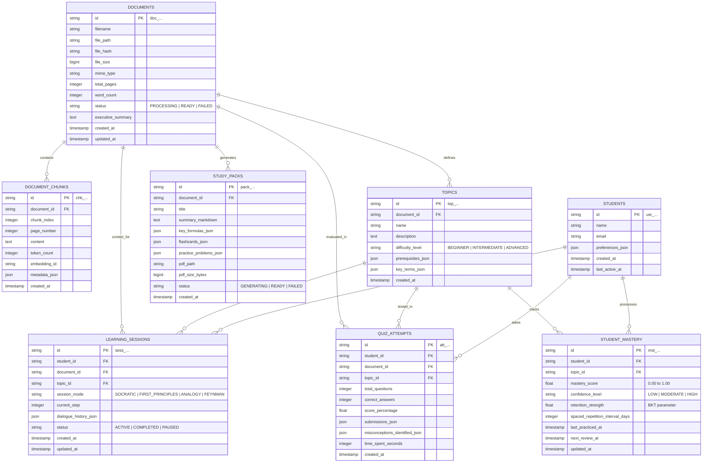

# LEARNOVA — Database Architecture & Entity Specifications

> **Primary Relational Engine:** SQLite 3.40+ (Local / Embedded) & PostgreSQL 16+ (Production Enterprise)  
> **ORM Layer:** SQLAlchemy 2.0 (Async) + Alembic Migrations  
> **Vector Engine:** ChromaDB / SQLite-vec (Cosine Distance Metric)

---

## 1. Entity-Relationship Diagram (ERD)



---

## 2. Relational Schema Specifications (DDL)

The schema is defined with agnostic SQL syntax compatible with SQLite 3 and PostgreSQL 16. JSON fields are stored as `TEXT` in SQLite and native `JSONB` in PostgreSQL.

### 2.1 Table: `students`
Stores student profile metadata and learning preferences.

```sql
CREATE TABLE IF NOT EXISTS students (
    id VARCHAR(36) PRIMARY KEY,
    name VARCHAR(255) NOT NULL,
    email VARCHAR(255) UNIQUE,
    preferences_json TEXT DEFAULT '{}',
    created_at TIMESTAMP WITH TIME ZONE DEFAULT CURRENT_TIMESTAMP,
    last_active_at TIMESTAMP WITH TIME ZONE DEFAULT CURRENT_TIMESTAMP
);

CREATE INDEX idx_students_email ON students(email);
```

### 2.2 Table: `documents`
Stores document records, upload state, and ingestion metrics.

```sql
CREATE TABLE IF NOT EXISTS documents (
    id VARCHAR(36) PRIMARY KEY,
    filename VARCHAR(512) NOT NULL,
    file_path VARCHAR(1024) NOT NULL,
    file_hash VARCHAR(64) NOT NULL,
    file_size BIGINT NOT NULL,
    mime_type VARCHAR(128) NOT NULL,
    total_pages INTEGER DEFAULT 0,
    word_count INTEGER DEFAULT 0,
    status VARCHAR(32) NOT NULL DEFAULT 'PROCESSING',
    executive_summary TEXT,
    created_at TIMESTAMP WITH TIME ZONE DEFAULT CURRENT_TIMESTAMP,
    updated_at TIMESTAMP WITH TIME ZONE DEFAULT CURRENT_TIMESTAMP
);

CREATE UNIQUE INDEX idx_documents_hash ON documents(file_hash);
CREATE INDEX idx_documents_status ON documents(status);
CREATE INDEX idx_documents_created ON documents(created_at DESC);
```

### 2.3 Table: `document_chunks`
Stores segmented source text chunks mapped directly to source pages and vector indices.

```sql
CREATE TABLE IF NOT EXISTS document_chunks (
    id VARCHAR(36) PRIMARY KEY,
    document_id VARCHAR(36) NOT NULL,
    chunk_index INTEGER NOT NULL,
    page_number INTEGER NOT NULL,
    content TEXT NOT NULL,
    token_count INTEGER NOT NULL,
    embedding_id VARCHAR(128),
    metadata_json TEXT DEFAULT '{}',
    created_at TIMESTAMP WITH TIME ZONE DEFAULT CURRENT_TIMESTAMP,
    CONSTRAINT fk_chunks_document FOREIGN KEY (document_id) 
        REFERENCES documents(id) ON DELETE CASCADE
);

CREATE INDEX idx_chunks_doc_idx ON document_chunks(document_id, chunk_index);
CREATE INDEX idx_chunks_page ON document_chunks(document_id, page_number);
```

### 2.4 Table: `topics`
Identifies extracted concepts and hierarchical prerequisites derived from document analysis.

```sql
CREATE TABLE IF NOT EXISTS topics (
    id VARCHAR(36) PRIMARY KEY,
    document_id VARCHAR(36) NOT NULL,
    name VARCHAR(255) NOT NULL,
    description TEXT,
    difficulty_level VARCHAR(32) DEFAULT 'INTERMEDIATE',
    prerequisites_json TEXT DEFAULT '[]',
    key_terms_json TEXT DEFAULT '[]',
    created_at TIMESTAMP WITH TIME ZONE DEFAULT CURRENT_TIMESTAMP,
    CONSTRAINT fk_topics_document FOREIGN KEY (document_id) 
        REFERENCES documents(id) ON DELETE CASCADE
);

CREATE INDEX idx_topics_doc ON topics(document_id);
CREATE INDEX idx_topics_name ON topics(name);
```

### 2.5 Table: `learning_sessions`
Captures stateful Socratic and scaffolding dialogue turns between student and tutor.

```sql
CREATE TABLE IF NOT EXISTS learning_sessions (
    id VARCHAR(36) PRIMARY KEY,
    student_id VARCHAR(36) NOT NULL,
    document_id VARCHAR(36) NOT NULL,
    topic_id VARCHAR(36),
    session_mode VARCHAR(32) NOT NULL DEFAULT 'SOCRATIC',
    current_step INTEGER NOT NULL DEFAULT 1,
    dialogue_history_json TEXT NOT NULL DEFAULT '[]',
    status VARCHAR(32) NOT NULL DEFAULT 'ACTIVE',
    created_at TIMESTAMP WITH TIME ZONE DEFAULT CURRENT_TIMESTAMP,
    updated_at TIMESTAMP WITH TIME ZONE DEFAULT CURRENT_TIMESTAMP,
    CONSTRAINT fk_sessions_student FOREIGN KEY (student_id) 
        REFERENCES students(id) ON DELETE CASCADE,
    CONSTRAINT fk_sessions_doc FOREIGN KEY (document_id) 
        REFERENCES documents(id) ON DELETE CASCADE,
    CONSTRAINT fk_sessions_topic FOREIGN KEY (topic_id) 
        REFERENCES topics(id) ON DELETE SET NULL
);

CREATE INDEX idx_sessions_student ON learning_sessions(student_id);
CREATE INDEX idx_sessions_doc_topic ON learning_sessions(document_id, topic_id);
```

### 2.6 Table: `quiz_attempts`
Records assessment attempts, student answer choices, identified misconceptions, and grading metrics.

```sql
CREATE TABLE IF NOT EXISTS quiz_attempts (
    id VARCHAR(36) PRIMARY KEY,
    student_id VARCHAR(36) NOT NULL,
    document_id VARCHAR(36) NOT NULL,
    topic_id VARCHAR(36),
    total_questions INTEGER NOT NULL,
    correct_answers INTEGER NOT NULL,
    score_percentage REAL NOT NULL,
    submissions_json TEXT NOT NULL DEFAULT '[]',
    misconceptions_identified_json TEXT NOT NULL DEFAULT '[]',
    time_spent_seconds INTEGER NOT NULL DEFAULT 0,
    created_at TIMESTAMP WITH TIME ZONE DEFAULT CURRENT_TIMESTAMP,
    CONSTRAINT fk_quizzes_student FOREIGN KEY (student_id) 
        REFERENCES students(id) ON DELETE CASCADE,
    CONSTRAINT fk_quizzes_doc FOREIGN KEY (document_id) 
        REFERENCES documents(id) ON DELETE CASCADE,
    CONSTRAINT fk_quizzes_topic FOREIGN KEY (topic_id) 
        REFERENCES topics(id) ON DELETE SET NULL
);

CREATE INDEX idx_quiz_student_topic ON quiz_attempts(student_id, topic_id);
CREATE INDEX idx_quiz_created ON quiz_attempts(created_at DESC);
```

### 2.7 Table: `student_mastery`
Stores granular Bayesian Knowledge Tracing scores and SuperMemo SM-2 spaced repetition state.

```sql
CREATE TABLE IF NOT EXISTS student_mastery (
    id VARCHAR(36) PRIMARY KEY,
    student_id VARCHAR(36) NOT NULL,
    topic_id VARCHAR(36) NOT NULL,
    mastery_score REAL NOT NULL DEFAULT 0.10,
    confidence_level VARCHAR(32) NOT NULL DEFAULT 'LOW',
    retention_strength REAL NOT NULL DEFAULT 1.0,
    spaced_repetition_interval_days INTEGER NOT NULL DEFAULT 1,
    last_practiced_at TIMESTAMP WITH TIME ZONE DEFAULT CURRENT_TIMESTAMP,
    next_review_at TIMESTAMP WITH TIME ZONE DEFAULT CURRENT_TIMESTAMP,
    updated_at TIMESTAMP WITH TIME ZONE DEFAULT CURRENT_TIMESTAMP,
    CONSTRAINT uq_student_topic UNIQUE (student_id, topic_id),
    CONSTRAINT fk_mastery_student FOREIGN KEY (student_id) 
        REFERENCES students(id) ON DELETE CASCADE,
    CONSTRAINT fk_mastery_topic FOREIGN KEY (topic_id) 
        REFERENCES topics(id) ON DELETE CASCADE
);

CREATE INDEX idx_mastery_review ON student_mastery(student_id, next_review_at);
CREATE INDEX idx_mastery_score ON student_mastery(student_id, mastery_score);
```

### 2.8 Table: `study_packs`
Records compiled study pack artifacts and links to rendered ReportLab PDF files.

```sql
CREATE TABLE IF NOT EXISTS study_packs (
    id VARCHAR(36) PRIMARY KEY,
    document_id VARCHAR(36) NOT NULL,
    title VARCHAR(512) NOT NULL,
    summary_markdown TEXT,
    key_formulas_json TEXT DEFAULT '[]',
    flashcards_json TEXT DEFAULT '[]',
    practice_problems_json TEXT DEFAULT '[]',
    pdf_path VARCHAR(1024),
    pdf_size_bytes BIGINT DEFAULT 0,
    status VARCHAR(32) NOT NULL DEFAULT 'GENERATING',
    created_at TIMESTAMP WITH TIME ZONE DEFAULT CURRENT_TIMESTAMP,
    CONSTRAINT fk_packs_doc FOREIGN KEY (document_id) 
        REFERENCES documents(id) ON DELETE CASCADE
);

CREATE INDEX idx_packs_doc ON study_packs(document_id);
CREATE INDEX idx_packs_status ON study_packs(status);
```

---

## 3. Vector Database Specification

### 3.1 Vector Store Engine: ChromaDB / SQLite-vec
- **Storage Strategy:** Persistent local directory at `storage/vector_store/` or embedded SQLite database with the `sqlite-vec` extension.
- **Collection Architecture:** Single partitioned collection `learnova_document_chunks` with metadata filtering on `document_id`.

### 3.2 Collection Configuration
```json
{
  "collection_name": "learnova_document_chunks",
  "metadata": {
    "hnsw:space": "cosine",
    "hnsw:construction_ef": 128,
    "hnsw:M": 16,
    "hnsw:search_ef": 64
  }
}
```

### 3.3 Vector Item Payload Structure
Every chunk stored in the vector database consists of:
- **`id` (str):** Deterministic chunk identifier, e.g., `chk_{doc_hash[:8]}_{chunk_index}`
- **`vector` (float[]):** 1536-dimensional (OpenAI `text-embedding-3-small`) or 768-dimensional (Google `text-embedding-004` / local HF `all-MiniLM-L6-v2`) dense vector.
- **`document` (str):** Normalized chunk text content.
- **`metadata` (dict):**
```json
{
  "chunk_id": "chk_8f12a34b_0042",
  "document_id": "doc_a1b2c3d4",
  "page_number": 14,
  "chunk_index": 42,
  "token_count": 612,
  "section_header": "2.3 The Born Interpretation and Wavefunction Normalization",
  "has_equations": true,
  "created_at": "2026-10-06T16:35:00Z"
}
```

### 3.4 Vector Search Query Parameters
- Metric: **Cosine Distance** (`1 - cosine_similarity`).
- Filter: `{"document_id": {"$eq": "doc_a1b2c3d4"}}`.
- Candidate selection: Top-8 vector candidates merged with Top-8 BM25 lexical candidates via Reciprocal Rank Fusion (RRF).

---

## 4. Migration Strategy & Integrity Rules

1. **Alembic Versioning:** All schema changes must be expressed as forward and backward (`upgrade()` / `downgrade()`) Python migrations in `backend/alembic/versions/`.
2. **Cascade Invariants:**
   - Deleting a `document` will cascade-delete all related `document_chunks`, `topics`, `study_packs`, and vector embeddings.
   - Deleting a `student` will cascade-delete their `learning_sessions`, `quiz_attempts`, and `student_mastery`.
3. **Data Integrity & Type Safety:**
   - Float constraints on `mastery_score` are strictly enforced between `0.0` and `1.0`.
   - String enums are validated via Pydantic models at runtime before reaching database transactions.
