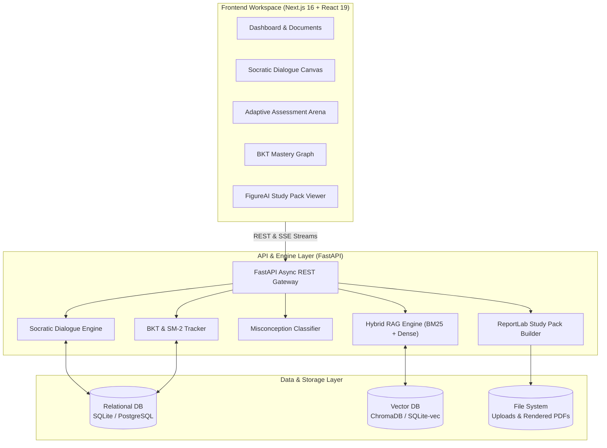

# LEARNOVA

<div align="center">

### AI Personal Teaching Assistant
**"Don't just help the student read... understand, practice, remember, master."**

[](https://fastapi.tiangolo.com)
[](https://nextjs.org)
[](https://python.org)
[](https://tailwindcss.com)
[](https://figure.ai)
[](LICENSE)

</div>

---

## 1. Overview

**LEARNOVA** is a production-grade, citation-grounded AI Personal Teaching Assistant engineered to transform passive reading into active, durable mastery.

While standard LLM chatbots act as passive summarizers or answers-on-demand bots—which inadvertently encourage superficial memorization and cognitive passivity—Learnova enforces a structured four-stage pedagogical cycle:

```
           ┌────────────────────────────────────────────────────────┐
           │                     LEARNOVA CYCLE                     │
           │                                                        │
           │    1. UNDERSTAND  ──►  2. PRACTICE                     │
           │          ▲                    │                        │
           │          │                    ▼                        │
           │       4. MASTER   ◄──  3. REMEMBER                     │
           └────────────────────────────────────────────────────────┘
```

1. **Understand (Scaffolded Comprehension):** The student interacts with a Socratic Tutor that deconstructs complex source material into first principles, using analogical reasoning and interactive inquiry without giving away answers prematurely.
2. **Practice (Active Retrieval & Misconception Diagnosis):** Dynamic quizzes, open-ended formative checks, and targeted flashcards assess the student's mental model. Errors are analyzed to isolate specific misconceptions (conceptual, procedural, factual, or terminological).
3. **Remember (Spaced Repetition & Cognitive Reinforcement):** Knowledge retention algorithms (adapted from SuperMemo SM-2 and Bayesian Knowledge Tracing) calculate decay intervals and schedule targeted re-testing before forgetting occurs.
4. **Master (Synthesized Artifacts & Proof-of-Competence):** Students generate high-fidelity, printable Study Packs formatted according to the **FigureAI** design philosophy via a dedicated ReportLab PDF engine, while their mastery profile updates deterministically.

---

## 2. Core Capabilities

### 🔍 Precision Citation-Grounded RAG
- **Hybrid Retrieval:** Dense vector embeddings (OpenAI / Gemini / HuggingFace) combined with BM25 lexical keyword ranking via **Reciprocal Rank Fusion (RRF)**.
- **Strict Grounding:** Every factual assertion carries an inline citation envelope: `[[Doc:<id>, Page:<p>, Chunk:<k>]]`.
- **Anti-Hallucination Shield:** Automatic cross-verification prevents hallucinated citations and flags unverified claims.

### 🏛️ Socratic Pedagogical Dialogue Engine
- **Active Inquiry:** The AI tutor acts as an academic mentor, asking diagnostic questions that lead students to discover insights themselves.
- **Scaffolding State Machine:** Dynamically toggles between Socratic questioning, first-principles deconstruction, intuitive analogies, and the Feynman technique.
- **Misconception Detective:** Classifies errors into **Conceptual**, **Procedural**, **Factual**, or **Terminological** slips, prescribing targeted hints without giving away answers.

### 📊 Adaptive Assessment & Bayesian Mastery
- **Discriminative Quiz Engine:** Generates MCQs and open-ended questions where distractors correspond to documented cognitive misconceptions.
- **Bayesian Knowledge Tracing (BKT):** Continuously models topic mastery probability $P(L_t)$, accounting for guess and slip factors.
- **SuperMemo SM-2 Spaced Repetition:** Calculates memory retention decay and schedules optimal review sessions.

### 📄 ReportLab High-Fidelity Study Pack Engine
- **FigureAI Aesthetic:** Print-ready, vector-sharp PDF study guides rendered with industrial minimalism, 1px hairline rules, and Space Grotesk typography.
- **Comprehensive Artifacts:** Includes executive conceptual summaries, equation sheets, misconception warning tables, flashcard cut-outs, and practice exam sets with answer keys.

---

## 3. FigureAI Design System Reference

Learnova's visual identity and generated documents follow the strict **FigureAI** monochrome design language:

```
  Lab White         Figure Black      Absolute Black    Machine Gray      Calibration Gray
  #ffffff           #0c0c0c           #000000           #6d6d6d           #cecece
  ██████████        ██████████        ██████████        ██████████        ██████████
```

- **Palette:** High-contrast monochromatic hierarchy. Lab White surfaces paired with Figure Black canvas, delineated by 1px Calibration Gray borders.
- **Typography:** **Space Grotesk** for geometric display headers, technical pills, and KPIs; **Inter** for readable pedagogical dialogue; **JetBrains Mono** for citations and equations.
- **Controls:** Pill-shaped action buttons (`rounded-full`), monospace technical rails, and zero gratuitous gradients or heavy drop-shadows.

---

## 4. System Architecture



---

## 5. Technology Stack

| Layer | Component | Specification |
| :--- | :--- | :--- |
| **Backend** | Framework | **FastAPI** `^0.115.0` (Python 3.11+) |
| | Validation | **Pydantic v2** & strict data schemas |
| | ORM & DB | **SQLAlchemy 2.0** with SQLite / PostgreSQL |
| | Vector Engine | **ChromaDB** / `sqlite-vec` (Cosine Distance) |
| | PDF Engine | **ReportLab** `^4.2.2` |
| | Parsers | **PyMuPDF** (`fitz`), `pdfplumber`, `python-docx` |
| **Frontend** | Framework | **Next.js 16** (React 19, TypeScript) |
| | Styling | **Tailwind CSS v4** (FigureAI monochrome theme) |
| | Typography | Space Grotesk (Display) & Inter (Body) |
| **AI Models** | Providers | **OpenAI**, **Anthropic Claude**, **Google Gemini**, **Ollama** |
| | Embeddings | `text-embedding-3-small`, `text-embedding-004`, `all-MiniLM-L6-v2` |

---

## 6. Quick Start Guide

### 6.1 Backend Setup (Terminal 1)
```bash
# 1. Clone repository & navigate to backend
git clone https://github.com/your-org/learnova.git
cd learnova

# 2. Setup virtual environment
python -m venv venv
# Windows: .\venv\Scripts\Activate.ps1 | macOS/Linux: source venv/bin/activate

# 3. Install dependencies
cd backend
pip install -r requirements.txt

# 4. Configure environment
cp .env.example .env
# Edit .env with your OpenAI, Anthropic, or Gemini API keys

# 5. Start FastAPI development server
uvicorn app.main:app --reload --port 8000
```
API Documentation will be live at: **`http://localhost:8000/docs`**

### 6.2 Frontend Setup (Terminal 2)
```bash
# 1. Navigate to frontend directory
cd learnova/frontend

# 2. Install dependencies
npm install

# 3. Configure environment
echo "NEXT_PUBLIC_API_URL=http://localhost:8000" > .env.local

# 4. Start Next.js development server
npm run dev
```
The application will be live at: **`http://localhost:3000`**

---

## 7. Project Documentation Index

For in-depth specifications, architectural contracts, and operational guidelines, consult the source of truth documentation:

- 🏛️ **[ARCHITECTURE.md](ARCHITECTURE.md)** — Architectural blueprint, FigureAI design tokens, Mermaid flows, and grounding guardrails.
- 🔌 **[API.md](API.md)** — Comprehensive REST API specification, schemas, error codes, and request/response examples.
- 🗄️ **[DATABASE.md](DATABASE.md)** — Relational schemas (DDL), Entity-Relationship Diagram (ERD), and vector index architecture.
- 🧠 **[AI.md](AI.md)** — Model provider abstractions, Socratic prompts, BKT, SM-2, and RRF RAG algorithms.
- 💻 **[DEVELOPMENT.md](DEVELOPMENT.md)** — Developer onboarding, environment setup, test suites, and troubleshooting guide.

---

## 8. License & Acknowledgements

Learnova is open-source software licensed under the [MIT License](LICENSE).  
Designed with aesthetic principles inspired by the FigureAI industrial minimalism philosophy.
